CRYPTO KEEPER README

Table of Contents:

Summary

Project Requirements

Local Setup

Overview of the Backend

Overview of the Frontend

User Flow and Views

SUMMARY

Crypto Keeper is a simple cryptocurrency investment platform that presents price history data for over one hundred cryptocurrencies. It also simulates the ability to buy and sell cryptocurrencies and track potential gains and losses due to price fluctuation.

For the frontend, I used the React library using TypeScript. I used several Material-UI components to style the app, as well as ApexCharts to display historical price fluctuation. I used the Coinbase Pro API to gather all cryptocurrency data used in this app.

For the backend server I used Node with the Express framework, also using TypeScript. The server connects with a PostgreSQL database which stores user and user' cryptocurrency ownership data.

The overall architural design for this app is the Model View Controller pattern. Much of these three responsibilities handled among the frontend React components, although the backend server does control the service of data from the database.

You can see this app live at: https://zen-curie-61e5e7.netlify.app

PROJECT REQUIREMENTS

* This app uses a modern JS Library/Framework:
  * React.js
* This app can be interacted with in a minimum of three different ways by the user:
  * Users can create a profile, log in, view stats for individual currencies, switch between time ranges for historical data, and buy and sell currencies (not actually, it's just simulated)
* The usage of a specified architural pattern:
  * This app uses a MVC pattern
* Integration with a backend service developed by you with CRUD operations:
  * This app makes use of a Node.js server I created that performs all of those operations, whether on users or their currency wallets
* Usage of at least 5 UI components from the material-ui/@core library
  * This app uses the Button, AppBar, ToolBar, List, ListItemButton, Input, InputLabel, Select, and MenuItem material-ui components
* An example of a reusable component that you have created and used in the app
  * The CurrencyGraph component can take in 

LOCAL SETUP

App Setup
1. Fork and clone this repository.
2. In the frontend directory, run 'npm install' to install the frontend dependencies.
3. In the backend directory, run 'npm install' to install the backend dependencies.

Database Setup
1. Download and install PostgreSQL.
2. In your terminal, run 'psql' to open the PostgreSQL shell.
3. Run 'CREATE DATABASE crypto_keeper_dev;'
4. Connect to the database by running '\c crypto_keeper_dev'
5. Create the users table by running 'CREATE TABLE users (id SERIAL PRIMARY KEY, name VARCHAR(50) UNIQUE NOT NULL, email VARCHAR(50) UNIQUE NOT NULL);'
6. Create the user_wallets table by running 'CREATE TABLE user_wallets (id SERIAL PRIMARY KEY, user_id INT, currency_id VARCHAR(10), amount NUMERIC (20,15), avg_cost NUMERIC (20,15));'

Starting the App
1. In the backend directory, run 'npm start'
2. In the frontend directory, run 'npm start'
3. Everything should be up and running!

OVERVIEW OF THE BACKEND

I designed the backend as an API that communicates user and user-owned currency data between a PostgreSQL database and the frontend; the API serves up that information in the JSON format.

I utilized two tables, users and user_wallets:

- The users table has rows representing each user, with columns for the user's id, name, and email.

- The user_wallets table contains has rows that represent each pairing of a user and a cryptocurrency (the row being generated when a user buys an amount of currency), with columns for the wallet id, user's id, cryptocurrency id, amount of that currency held by the user, and the average cost paid by the user for that currency.

I have included routes to create a new user, get a list of users, get a single user, update a user, and delete a user, although only the first two are utilized by the frontend as it currently exists. As for user wallets, I have included routes to create a new user wallet, get a user wallet for a given user-currency pair, update a user wallet, delete a user wallet, and get all wallets associated with a particular user, although only the first three routes are utilized by the frontend as it currently exists.

OVERVIEW OF THE FRONTEND

Components:
* App - The top level component. It stores the current user in state (if someone is logged in) and passes it down to child components NavBar, Home, and CurrencyPage, the rendering of which will change depending on whether a user is logged in or not. This component includes the handleLogin function, which sets the current user and navigates to the home page. The NavBar is always rendered, and the Home, LogInSignUp, and CurrencyPage components are conditionally rendered and are tied to their respective Routes (a function of react-router-dom).

* NavBar - This component is always fixed to the top of the page and displays the app title on the left (doubling as a NavLink (another react-router-dom feature) that transports the user to the Home page). On the right side is either a NavLink leading to the LogInSignUp component page or a Log Out button that logs the user out, depending on whether a user is logged out or not.

* LogInSignUp - This component has a button that toggles which of the SignUp or the LogIn child components are rendered.

* LogIn - Upon render, this component fetches a list of users from the backend, sets the userList state to an array of the users (each user represented by an object containing their id, name, and email) and populates a dropdown menu with their names. Upon selection of a user name, a Log In button becomes enabled, the clicking of which will trigger the handleLogin function (passed down from the App component), passing it the selected user object.

* SignUp - This component contains a form with controlled inputs for a user's name and email that are tracked in state as the object formData. Upon submitting the form, a fetch post request is sent to the backend, with the body in the form of { name: ' ', email: ' '}. If successful, the created user object will be sent back in the response and the handleLogin function (again, passed down from App) will set the new user object as the current user.

* Home - This component displays a welcome message that includes the logged in user's name if anyone is logged in. It also renders the CurrencyList component.

* CurrencyList - This component, on initial render, fetches a list of currencies from the Coinbase API via the url 'https://api.exchange.coinbase.com/currencies'. This returns an array of objects, each representing a currency and containing a host of information. Upon a successful fetch, the array is filtered to remove a few fiat currencies (USD, GBP, EUR), sorted by it's 'sort_order' value (which I have assumed is popularity or activity, but I could be wrong), and then stored in state. That state is then passed through a filter which matches the currencies to any value entered into the search field (a controlled input, the value of which is held in the searchText state). This filtered list (which when the search field is empty contains all currencies) is then used to populate a scrollable list that displays each currency's name and symbol/id. A button toggles the sortAlpha state which switches the list between alphabetical and popularity ordering. Each list item is clickable, and when clicked will navigate the user to the currency's individual page (passing along the currency's name and id in the route parameters).

* CurrencyPage - This component, on initial render, performs either one or two fetches. First, it fetches from the Coinbase API the currency's ticker via the url 'https://api.exchange.coinbase.com/products/*Currency ID/symbol here*-USD/ticker'. This returns an object containing several pieces of information, the only one of which I use is the current price. The cryptoPrice state is set to that value upon a successful response. If a user is logged in, a second fetch to my own API is performed; this sends in the request parameters the user's id and the currency's id, which are used to find a matching user wallet in the database. If there is such a wallet (where the user owns some of the currency or has in the past), thisWallet state is set to the returned object (in the form of {id: , user_id: , currency_id: , amount: , avg_cost: }). If there is no wallet, thisWallet remains null. thisWallet is passed down to and used by the CurrencyAccount component. This component then renders the CurrencyGraph component and the CurrencyAccount component, the latter only if a user is logged in.

* CurrencyGraph - This component primarily handles the data gathering for its child component, CandlestickChart. Upon initial rendering, the component attempts to fetch from the Coinbase API candle data for the given currency over a specific span of time and at a particular granularity. These specifications are injected into the fetch url (https://api.exchange.coinbase.com/products/$*Currency ID/symbol here*-USD/candles?granularity=*chosen granularity*&start=*start date and time*&end=*end date and time*). The default specifications are set to the period covering the 24 hours leading up to the present moment, with a granularity of 900 (which means a point of data for every 15 minutes). The makeDateParams function does the work of capturing the present moment as the end point, creating a starting point the appropriate length of time before the end point, and setting the granularity. All of these specifications are stored in an object which is used to inject the correct parameters into the fetch url. makeDateParams will produce different specifications depending on the argument passed into it. This argument is set by the drop down menu, with options for the last 24 hours, 30 days, and 6 months, each with a different granularity. When the drop down menu is changed, a new fetch is performed to collect the appropriate range of data. The Coinbase API returns an array of arrays, each of which represents one candle (or point of data). These candles are in the form of [timestamp, low, high, open, close]. The array of arrays is then passed into the convertCandleData function, which transforms each candle to a different form: {x: *reformatted timestamp*, y: [open, high, low, close] }. An array of the reformatted candles is passed down to the child component Candlestick Chart.

* CandlestickChart - This component takes in the reformatted candle data and passes it to an ApexCharts component that presents the dataset in a readable and interactable manner.

* CurrencyAccount - This is a sibling component to CurrencyGraph and only renders when a user is logged in. It takes in the user's information, their wallet for the given currency if one exists, and the currency's data (id, name, and price). If the user owns any of the currency, it displays how many coins are owned, the average cost paid by the user, and the percentage of lost or gained value of their holdings relative to the current currency price. Two buttons appear below this informational display: a Buy button and a Sell button. The Sell button is only enabled if the user owns some amount of the currency, and the Buy button is always enabled. Upon clicking either button, the BuyWindow or SellWindow are rendered accordingly, along with a Cancel button that closes the newly opened component.

* BuyWindow - This component opens up a form with a field where the user may enter the amount of the currency they wish to buy. As values are entered, the cost is automatically calculated and displayed. Once the user has entered the desired amount, they may click the Submit Buy button. This triggers one of two actions. If the user already has a wallet associated with the currency, an updated currency amount and average cost are calculated by taking into account the old amount, the old average cost, the new amount, and the cost of the new amount. The determined values are then sent in a PUT request to the backend, which updates the user's wallet of that currency and then sends back the updated wallet object to which thisWallet state is set. If the user does not have a wallet associated with the currency, a new wallet object is constructed with the user's id, the currency's id, the amount bought, and the cost of the buy. This object is then sent to the backend via a POST request. The response, a newly created user wallet, is then set to the thisWallet state.

* SellWindow - This component behaves like the BuyWindow (although, because a user necessarily has a wallet if they are accessing this component, selling only triggers an update PUT request to the backend). A new average cost and amount of currency are similarly calculated.

* ErrorDisplay - This component is rendered and displays error details in the event of a bad fetch response within any components where that may occur.

USER FLOW AND VIEWS

On starting up Crypto Keeper a user will be greeted by the welcome page, which includes a scrollable list of all the cryptocurrencies that may be viewed. The list may be searched by typing in search box, which will continually filter the list to include only matching currencies or currency symbols. The list may also be toggled between alphabetical order and order of popularity (the default) by clicking on the button next to the search field. Clicking on 'CRYPTO KEEPER' in the top right will always return a user to this page.

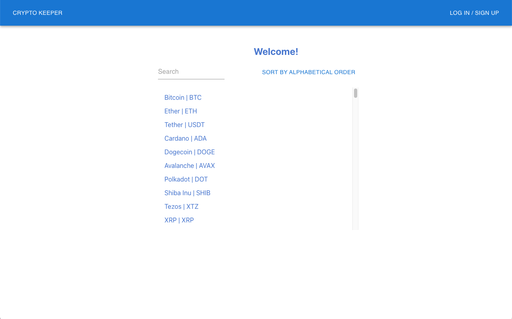

By clicking on the 'LOG IN / SIGN UP' button in the top right will take the user to the Log In page, where they may select their username from the dropdown menu if they have already made an account. They may then click the Log In button once they have selected their username.

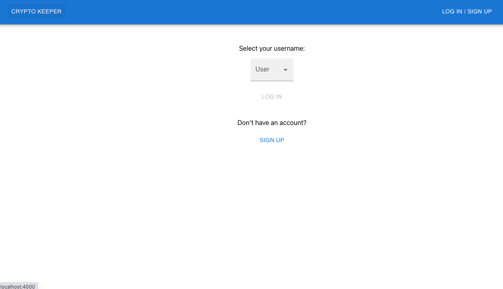

If they do not yet have an account, the user may click the Sign Up button, which will replace the dropdown with a form where they can enter their name and email and then click the Create Account button.

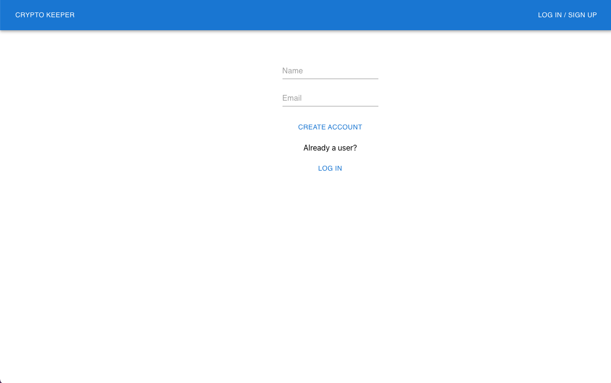

When the user clicks either the Create Account or Log In button, they are logged in as the current (or recently created) user and redirected to the home page, this time with a personalized welcome message. Where the 'LOG IN / SIGN UP' button was previously is now a 'LOG OUT' button, which will log the user out when clicked. There will also now be a DELETE YOUR ACCOUNT BUTTON below which will delete the user's profile.

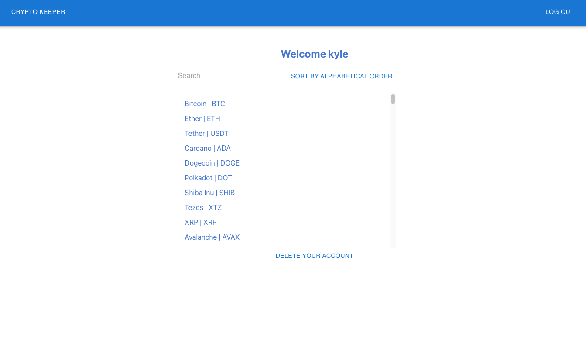

A user may click on any currency in the list to be directed to that currency's page, which will look different based on if the user is logged in or not. If the user is a guest, the page will display the current price of the currency and a candlestick chart showing the currency's price movement over the past 24 hours.

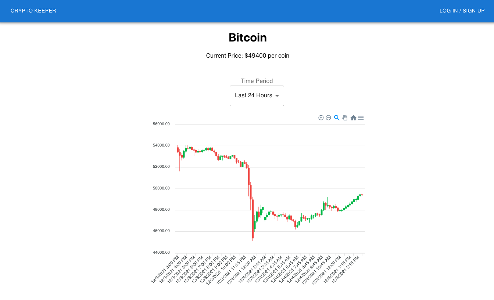

The user may select additional time periods (the past 30 days and the past 6 months) for the display of historical price fluctuation.

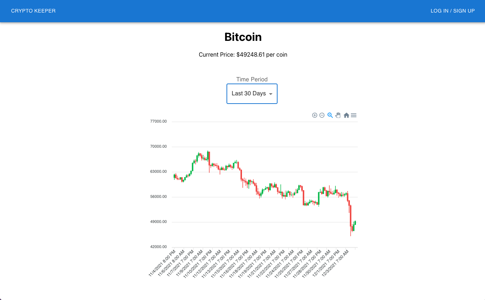

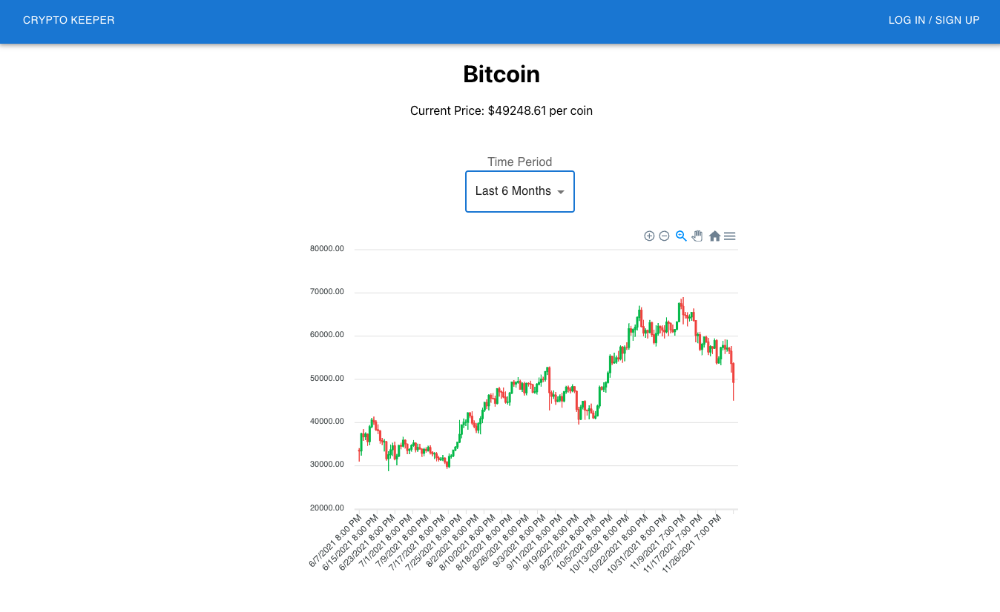

If a user is logged in, the currency page will appear different. The candlestick chart will be on the left (with the same time period options), but now the user's ownership information and buying/selling options will appear on the right. Initially a user will not own any currency, and so the sell button will be disabled.

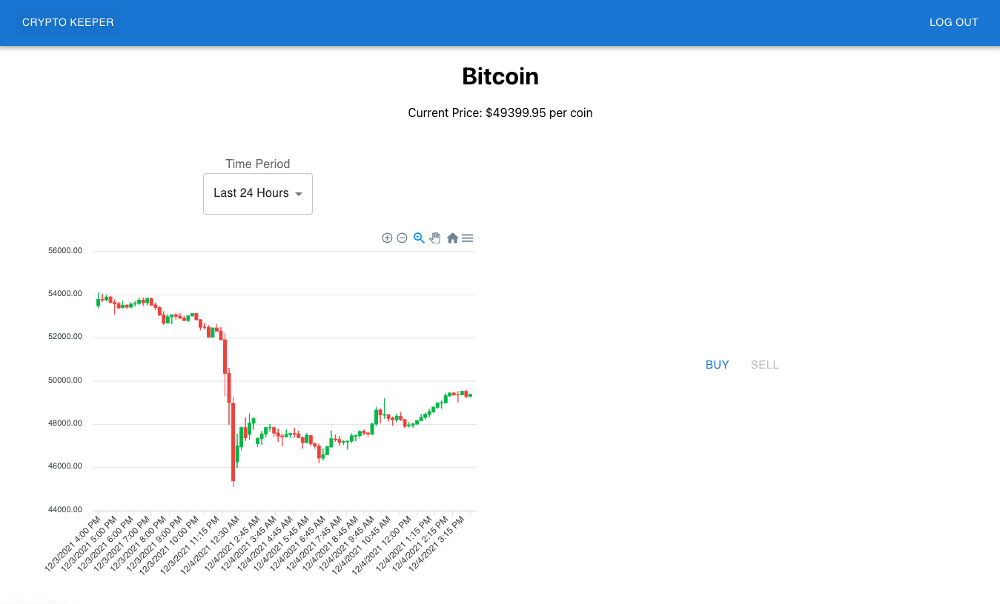

If a user clicks on the Buy button, the buy form will appear. The cost in USD will update automatically to reflect the number of coins entered into the field. A user can purchase any fraction of a coin.

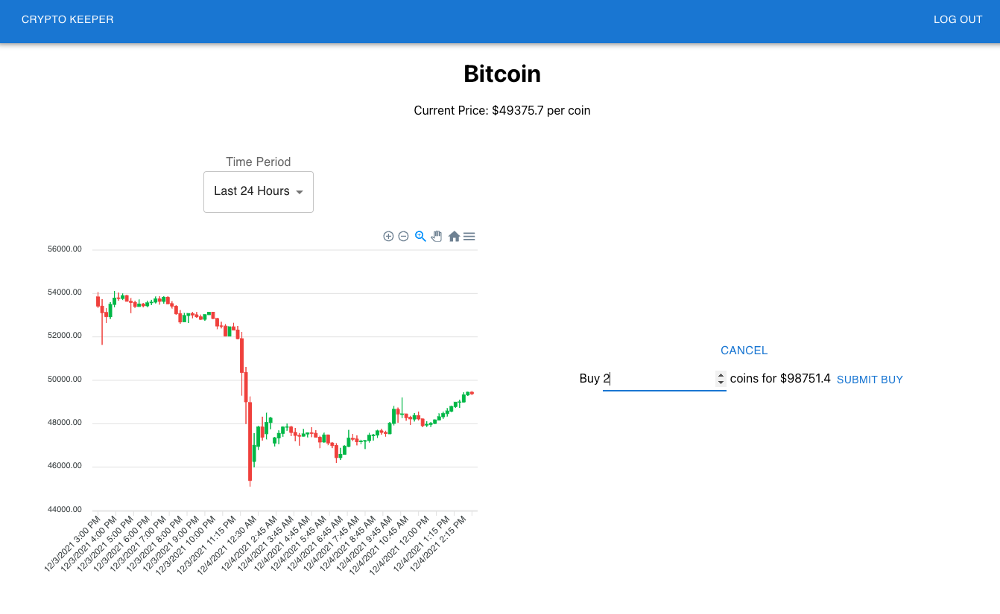

Once a user owns some of the currency, the amount of currency owned will be displayed along with the loss or gain of value since purchase (determined by comparing the average cost of the currency bought against the current value of the currency). The Sell button will now be available.

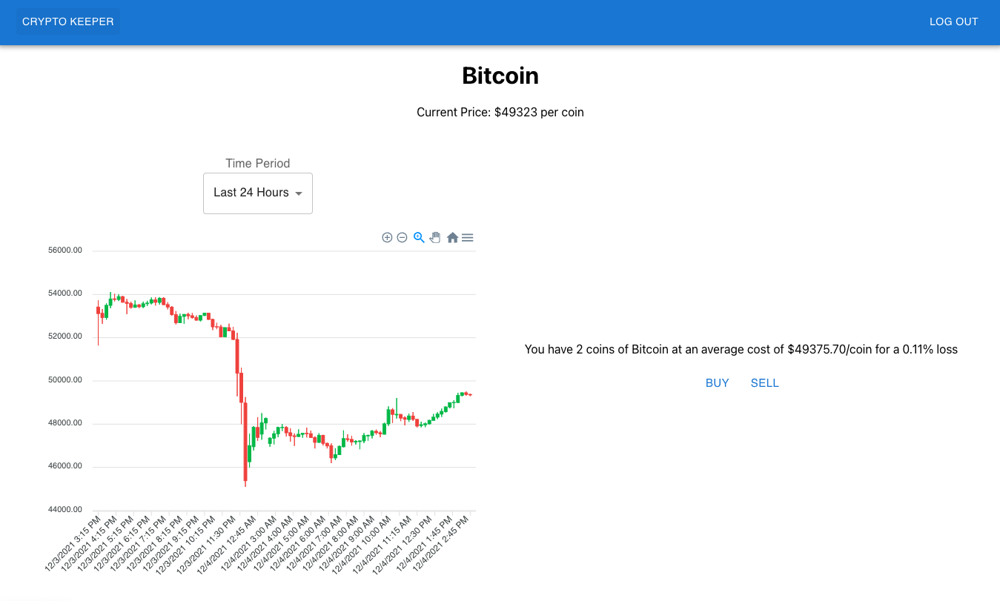

If a user clicks on the Sell button, the sell form will appear. This form behaves similarly to the buy form.

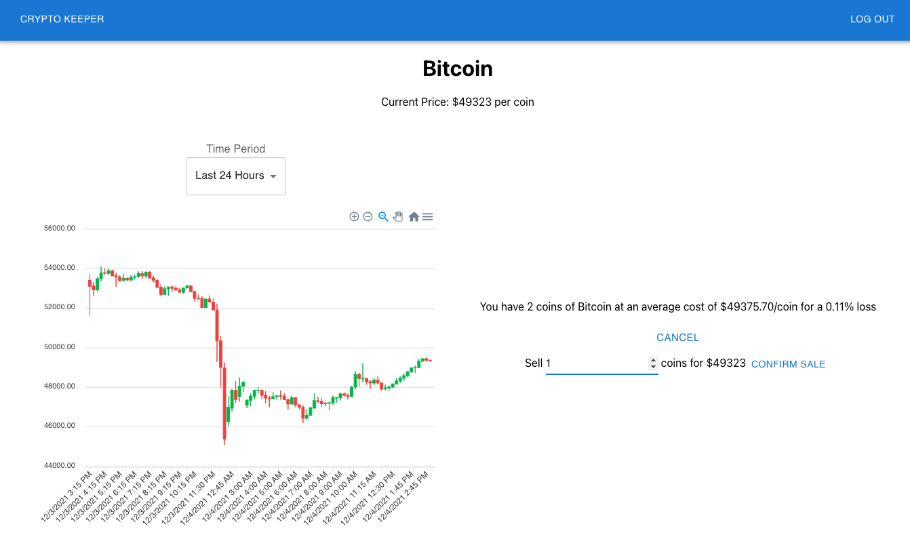